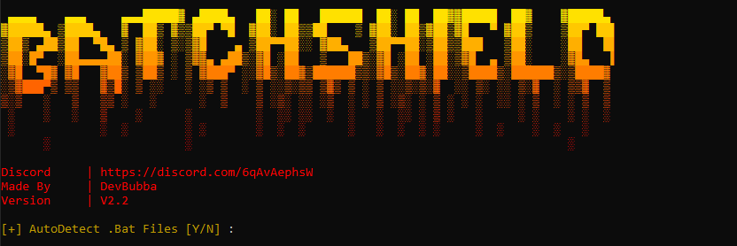
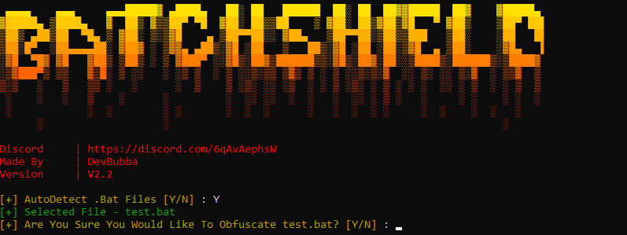
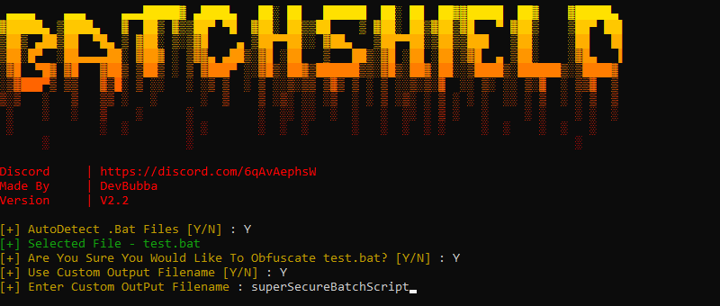
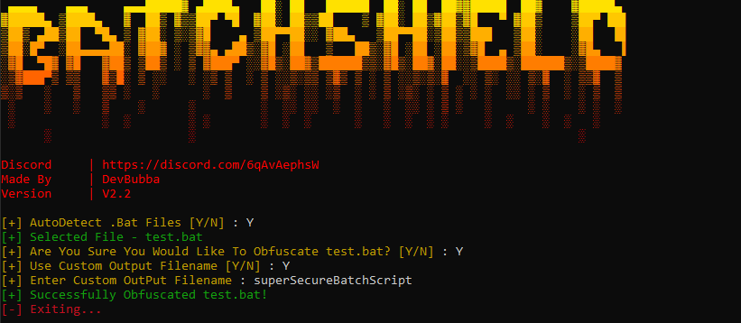

    
    
     
     
    
     
    
    
     

#  🔒 〢 BatchShield

### Simple And Easy Batch Obfuscator Made In Python V3.11.2 For Your Daily Use With Batch To Just Make Things Easy On Yourself Making Sure The Real Code Is Hidden From Skids Or Anyone Else Using Your Batch Script!

## 🌐 〢 Table Of Contents

- **[📖 〢 Description](#description)**
- **[🔰 〢 Features](#features)**
- **[🔗 〢 Discord](https://discord.gg/6qAvAephsW)**
- **[📥 〢 Install](#install)**
  - **[💻 〢 Prerequisites](#prerequisites)**
  - **[⚙ 〢 Setup](#setup)**
- **[📷 〢 Preview](#preview)**
- **[📚 〢 Changelog](#changelog)**
- **[⚠️ 〢 Bugs Or Errors](#bugsorerrors)**
- **[🧾 〢 Lisence](#lisence)**

##  🔰 〢 Features

- `Auto Ignores Installer Batch File To Ensure That No Other Batch Files Are Recognized By BatchShield`🟢
- `Allow Custom Input Path (.bat)`🟢
- `Auto Detect All Batch Files (.bat)`🟢
- `May Work On Other Python Version V3.0+`🟢
- `Auto Install Missing Modules`🟢
- `Custom Obfuscated Batch File Name (.bat) (Output File Name)`🟢
- `Auto Update Module Installer`🟢
- `Add Extra Obfuscation Strength`🟡
- `Exe (Executable File) Version Of BatchShield (Compiled Version)`🟡
- `Auto Update Tool`🟡
- `More Obfuscation Methods/Levels`🟡
- `Obfuscates More Than Just Batch Files`🔴
- `Works On MacBook Or Other Devices Other Than Windows Operating Systems`🔴

🟢 = Working  | 🟡 = To Do  | 🔴 = Not Working

##  📥 〢 Install

1. Download The Source Code **[Here](https://github.com/DevBubba/BatchShield/archive/refs/heads/main.zip)** Or Your Prefered Version Of BatchShield
2. Extract The Downloaded Source Code
3. Make Sure Python Is Installed If Not Install It **[Here](https://www.python.org/downloads/release/python-3112/)**
4. Done!
   
###  💻 〢 Prerequisites

-   Windows 7/10/11
-   **[Python V3.0.0 And Above](https://www.python.org)**

###  ⚙️ Setup

1. Open installer.bat And Wait For All Required Modules To be Installed
2. Simply Open main.py And Enjoy Obfuscating With Ease Using BatchShield!

##  📷 〢 Preview

    
    
    </img>
    </img>
    </img>
    
 

##  📚 〢 Changelog 

All Notable Changes To BatchShield (This Project) Will Be Documented In This [File](https://github.com/DevBubba/BatchShield/blob/main/CHANGELOG.md)

##  ⚠️ Bugs Or Errors?

-   To Report An Error Make An **[Issue](https://github.com/DevBubba/BatchShield/issues)**
-   Or Join The **[Discord](https://discord.gg/6qAvAephsW)**

## 🧾  License

### This is for educational purposes only, use at your own risk, I am not responsible for any of your actions!
### BatchShield is licensed under the <a href="https://mit-license.org/.">MIT License</a>

